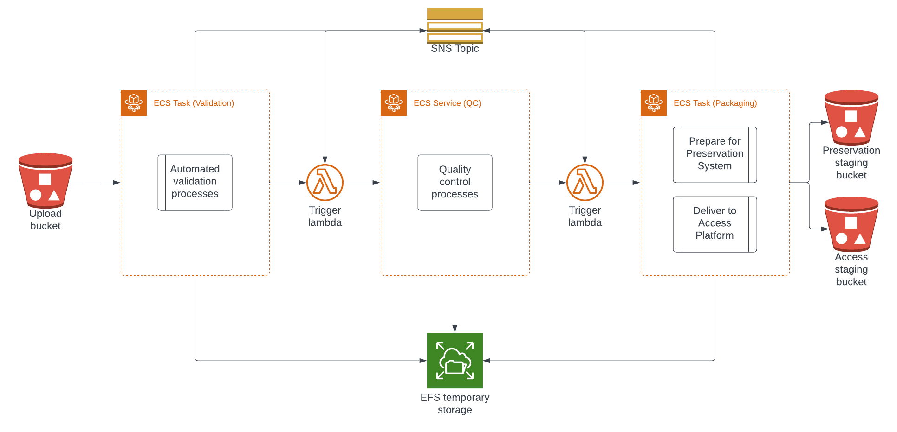

# digitized_image_pipeline
Pipeline for transferring, validating and packaging digitized still image and text assets.

## Usage

This repository is intended to be deployed in AWS infrastructure. It contains CloudFormation 
templates which deploy a number of apps (see [Related Repositories section](#related-repositories) below) 
that together constitute the pipeline.

# Architecture Diagram

## Related Repositories

- [digitized_image_validation](https://github.com/RockefellerArchiveCenter/digitized_image_validation/) - an ECS Task that
  validates packages the fixity, structure and file characteristics of a package.
- [digitized_image_qc](https://github.com/RockefellerArchiveCenter/digitized_image_qc/) - an ECS Service that provides a web
  interface for quality control and assigning structured rights to packages.
- [digitized_image_packaging](https://github.com/RockefellerArchiveCenter/digitized_image_packaging/) - an ECS Task that 
  structures packages and delivers them to a destination for further processing.
- [digitized_image_notifications](https://github.com/RockefellerArchiveCenter/digitized_image_notifications/) - a Lambda that 
  handles notifications for services associated with the ingest of digitized audiovisual content.
- [digitized_image_trigger](https://github.com/RockefellerArchiveCenter/digitized_image_trigger/) - a Lambda that invokes 
  AWS Elastic Container Service (ECS) tasks and services based on SNS and S3 messages.

## License

This code is released under the [MIT License](LICENSE).